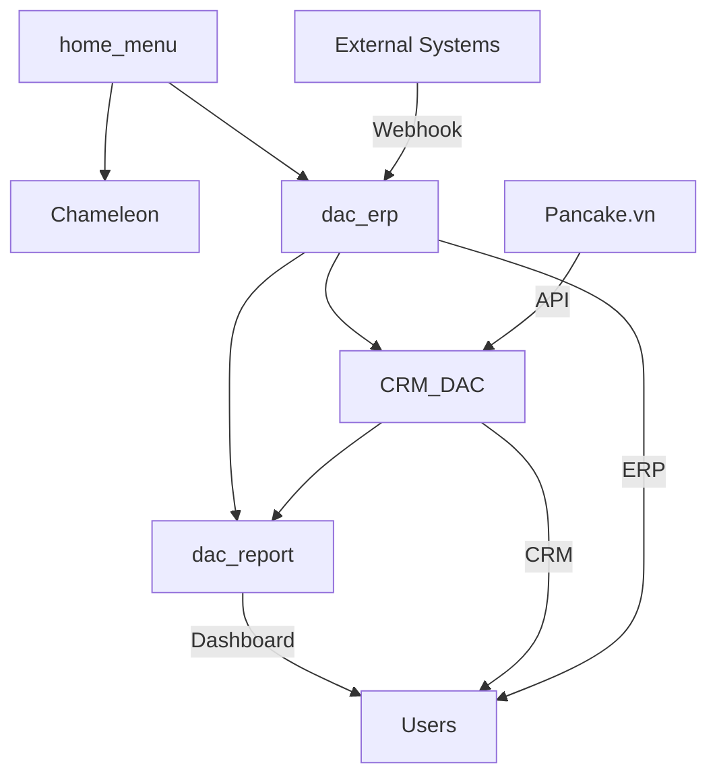

# DuyAn CRM - Hệ thống Quản lý Khách hàng & ERP

## 📋 Tổng quan hệ thống

Hệ thống DuyAn CRM là một giải pháp quản lý khách hàng và ERP tích hợp hoàn chỉnh được xây dựng trên nền tảng Odoo 18.0, được thiết kế đặc biệt cho Duy An Company. Hệ thống bao gồm 5 module chính tương tác với nhau để tạo nên một hệ sinh thái quản lý doanh nghiệp đầy đủ.

## 🏗️ Kiến trúc hệ thống

```
📁 addons/
├── 🎨 Chameleon/           # Theme & UI Customization
├── 🤝 CRM_DAC/             # Customer Relationship Management
├── 💼 dac_erp/             # Enterprise Resource Planning
├── 📊 dac_report/          # Dashboard & Reports
└── 🏠 home_menu/           # Home Menu & Navigation
```

## 📦 Module Chi tiết

### 🎨 Chameleon - Theme & UI Customization

**Mục đích:** Tùy chỉnh giao diện và theme cho hệ thống

**Chức năng chính:**

- Thay đổi màu sắc theme theo sở thích
- Tùy chỉnh giao diện người dùng
- Cung cấp các template giao diện tùy biến

**Cấu trúc:**

```
Chameleon/
├── models/
│   └── resConfigSettings.py          # Cấu hình theme
├── views/
│   ├── Chameleon.xml                 # Main theme views
│   ├── ChangeColorTheme.xml          # Color customization
│   ├── course_list_template.xml      # Course templates
│   └── ResConfigSettings.xml         # Settings views
└── static/
    ├── description/                  # Module description
    └── src/                         # CSS, JS, Images
```

**Dependencies:** `base`, `web`

---

### 🤝 CRM_DAC - Customer Relationship Management

**Mục đích:** Quản lý cuộc trò chuyện khách hàng và đồng bộ dữ liệu từ Pancake.vn

**Chức năng chính:**

- 🔄 **Đồng bộ hội thoại**: Tự động đồng bộ cuộc trò chuyện từ Pancake.vn (Zalo, Facebook)
- 💬 **Quản lý tin nhắn**: Hiển thị và quản lý tin nhắn chi tiết
- 👥 **Quản lý khách hàng**: Liên kết conversations với partner records
- 📈 **KPI tracking**: Theo dõi hiệu suất nhân viên bán hàng
- 🔔 **Workflow management**: Quản lý trạng thái xử lý cuộc hội thoại

**Models chính:**

- `page.fm.page`: Quản lý Pages từ Pancake
- `page.fm.conversation`: Cuộc trò chuyện khách hàng
- `page.fm.message`: Tin nhắn chi tiết
- `kpi.sale.daily`: KPI hàng ngày của nhân viên

**Cấu trúc:**

```
CRM_DAC/
├── models/
│   ├── page_fm_models.py                    # Page management
│   ├── page_fm_conversation_models.py       # Conversation logic
│   ├── page_fm_message_models.py           # Message handling
│   ├── kpi_sale_daily.py                   # KPI calculations
│   └── res_ext.py                          # Partner extensions
├── controllers/
│   └── main.py                             # Web controllers
├── views/
│   ├── page_fm_conversation_views.xml      # Conversation UI
│   ├── page_fm_page_views.xml              # Page management UI
│   └── KPI_View.xml                        # KPI dashboard
├── wizard/
│   └── conversation_message_sync_wizard.py # Sync wizard
└── data/
    └── cron_pancake.xml                    # Scheduled jobs
```

**API Integration:**

- Pancake.vn API để đồng bộ conversations
- Webhook receivers cho real-time updates
- Token management và caching

**Dependencies:** `base`, `web`, `dac_erp`, `home_menu`

---

### 💼 dac_erp - Enterprise Resource Planning

**Mục đích:** Core ERP functionality cho quản lý bán hàng, kế toán và sản phẩm

**Chức năng chính:**

- 📋 **Quản lý đơn hàng**: Workflow đơn hàng từ báo giá đến hoàn thành
- 💰 **Quản lý thanh toán**: Tracking payments, deposits
- 📊 **Data Export API**: RESTful API để export toàn bộ dữ liệu
- 🔗 **Webhook Integration**: Nhận webhook từ các hệ thống external
- 👤 **User Management**: Phân quyền và quản lý người dùng
- 📦 **Product Management**: Quản lý sản phẩm và pricing

**Models chính:**

- `sale.order`: Đơn hàng (extended)
- `sale.order.line`: Dòng đơn hàng (extended)
- `account.move`: Hóa đơn (extended)
- `account.payment`: Thanh toán (extended)
- `product.template`: Sản phẩm (extended)

**Cấu trúc:**

```
dac_erp/
├── models/
│   ├── sale_order.py                 # Order management
│   ├── sale_order_line_inherit.py    # Order line extensions
│   ├── account_move.py               # Invoice handling
│   ├── account_payment.py            # Payment processing
│   └── product_template_inherit.py   # Product extensions
├── controllers/
│   ├── data_export_controller.py     # Data export API
│   └── pancake_webhook_controller.py # Webhook handlers
├── views/
│   ├── sale_order_view.xml           # Order forms & lists
│   ├── account_move_view.xml         # Invoice views
│   └── account_payment_view.xml      # Payment views
├── security/
│   ├── user_access.xml               # User groups
│   ├── sale_order_access_rules.xml   # Order access rules
│   └── account_access_rules.xml      # Accounting access rules
└── data/
    ├── currency_data.xml             # Currency setup
    └── cron_data.xml                 # Scheduled jobs
```

**API Endpoints:**

- `/api/export/all` - Export toàn bộ dữ liệu
- `/api/export/sales` - Export đơn hàng
- `/api/export/customers` - Export khách hàng
- `/api/export/invoices` - Export hóa đơn
- `/api/export/payments` - Export thanh toán
- `/webhook/pancake` - Webhook từ Pancake

**Dependencies:** `base`, `web`, `home_menu`, `Chameleon`, `sale`, `sale_management`, `account`, `product`

---

### 📊 dac_report - Dashboard & Reports

**Mục đích:** Báo cáo và dashboard theo dõi hiệu suất kinh doanh

**Chức năng chính:**

- 📈 **Sales Dashboard**: Dashboard tổng quan doanh thu và KPI
- 🎯 **Target Tracking**: Theo dõi mục tiêu doanh thu
- 👥 **Customer Analytics**: Phân tích khách hàng và conversion
- 📊 **Real-time Reporting**: Báo cáo thời gian thực
- 🔄 **Interactive UI**: Giao diện tương tác với các widget động

**Components chính:**

- **Header KPIs**: Doanh thu, mục tiêu, progress
- **Consulting Pipeline**: Khách hàng đang tư vấn
- **Quotation Tracking**: Đơn hàng đã báo giá
- **Manufacturing Status**: Trạng thái sản xuất
- **Receivables**: Công nợ cần thu
- **Completed Orders**: Đơn hàng đã hoàn thành

**Cấu trúc:**

```
dac_report/
├── models/
│   └── dashboard.py                  # Dashboard logic
├── static/src/
│   ├── js/backend/
│   │   └── dashboard.js              # Frontend logic
│   ├── css/backend/
│   │   └── dac_report.css           # Dashboard styling
│   └── xml/backend/
│       └── sale_dashboard.xml        # Dashboard templates
└── views/
    └── menuitem.xml                  # Menu definitions
```

**Technical Features:**

- OWL Components cho interactive UI
- Real-time data loading
- Responsive design
- Custom CSS styling
- Action integration

**Dependencies:** `base`, `web`, `dac_erp`, `CRM_DAC`, `sale`, `account`, `sale_management`, `product`

---

### 🏠 home_menu - Home Menu & Navigation

**Mục đích:** Tùy chỉnh menu chính và navigation của hệ thống

**Chức năng chính:**

- 🧭 Cấu trúc menu chính
- 🔗 Navigation links
- 🎨 Home page customization
- 📱 Mobile-friendly navigation

**Dependencies:** `base`, `web`

---

## 🔗 Mối quan hệ giữa các Module



## 🚀 Workflow Hoạt động

### 1. Customer Journey

```
Pancake.vn → CRM_DAC → dac_erp → dac_report
     ↓           ↓         ↓          ↓
  Messages → Conversations → Orders → Analytics
```

### 2. Data Flow

1. **Thu thập**: CRM_DAC đồng bộ conversations từ Pancake.vn
2. **Xử lý**: Conversations được convert thành leads/opportunities
3. **Quản lý**: dac_erp quản lý sales pipeline và orders
4. **Báo cáo**: dac_report hiển thị analytics và KPIs

## 🔧 Cài đặt & Cấu hình

### Thứ tự cài đặt modules:

1. `home_menu` (base navigation)
2. `Chameleon` (theme foundation)
3. `dac_erp` (core ERP)
4. `CRM_DAC` (CRM functionality)
5. `dac_report` (dashboards)

### Cấu hình cần thiết:

- **Pancake.vn API**: Cấu hình access tokens trong Settings
- **User Groups**: Thiết lập phân quyền users
- **Cron Jobs**: Kích hoạt scheduled tasks
- **Webhooks**: Cấu hình webhook URLs

## 📊 Key Features

### 🤖 Automation

- Tự động đồng bộ conversations từ social platforms
- Auto-assign conversations cho sales teams
- Scheduled data synchronization
- Automated KPI calculations

### 🔐 Security

- Role-based access control
- Multi-level user permissions
- Data isolation theo team/department
- Secure API endpoints

### 📱 User Experience

- Responsive dashboard design
- Real-time notifications
- Interactive conversation management
- Mobile-friendly interface

### 🔌 Integration

- Pancake.vn API integration
- RESTful data export APIs
- Webhook support
- External system connectivity

## 🛠️ Technical Stack

- **Backend**: Odoo 18.0 (Python)
- **Frontend**: OWL Framework, JavaScript, CSS3
- **Database**: PostgreSQL
- **API**: REST, Webhooks
- **Integration**: Pancake.vn, External systems

## 📈 Metrics & KPIs

Hệ thống tracking các KPIs chính:

- **Sales Metrics**: Revenue, conversion rates, pipeline value
- **Customer Metrics**: Response time, satisfaction, retention
- **Employee Metrics**: Performance, productivity, targets
- **Operational Metrics**: Process efficiency, data accuracy

## 🚀 Roadmap

### Planned Features:

- AI-powered conversation analysis
- Advanced reporting and analytics
- Mobile app development
- Additional social platform integrations
- Enhanced automation workflows

---

**Tác giả**: Huỳnh Quốc An  
**Phiên bản**: 1.0  
**Cập nhật**: September 2025  
**Công ty**: Duy An Company
